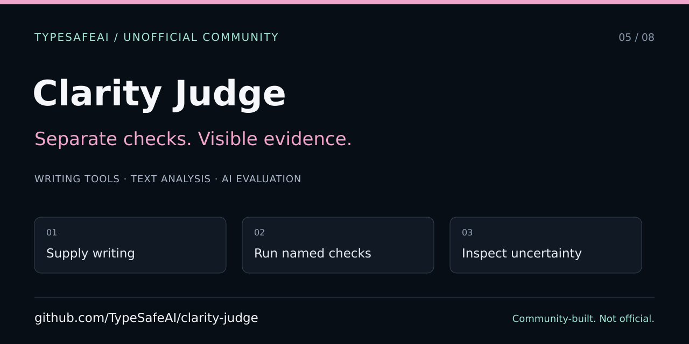

# Clarity Judge — developer and agent entry point

> Unofficial TypeSafeAI community project, not an official TypeSafe AI product. Community organization created by VC Moderator [@BunsDev](https://github.com/BunsDev).



[Setup and usage](../../README.md) · [Agent instructions](../../AGENTS.md) · [Contributing](../../CONTRIBUTING.md) · [Screenshot protocol](SCREENSHOTS.md)

## Start with a no-key demonstration

Clarity Judge evaluates supplied writing against separate named checks. It does not rewrite the text, verify its facts, or provide a universal writing score. Start with the synthetic examples and local demo mode. Live evaluation is an explicit, separately configured provider operation.

Use the exact pnpm version in `package.json` and `pnpm install --frozen-lockfile`; preserve the single lockfile and secret guards. Read the README before supplying a key or deploying a shared server credential. A browser key stored in localStorage is not encrypted by the app.

## Project map

| Area | Responsibility |
| --- | --- |
| `lib/builtInAxes.ts` | Stable check definitions and problem-answer polarity |
| `lib/judge.ts` | Request orchestration, mapping, optional evidence selection, and usage display |
| `lib/jevClient.ts` | Provider wire format and errors |
| `lib/mockJevClient.ts` | Deterministic demo behavior |
| `lib/evidenceHeuristic.ts` | Approximate local source matching |
| `components/JudgeWorkspace.tsx` | Writing and judgment interaction |
| `app/api/judge/route.ts` | Server-side provider boundary |
| `lib/social.ts`, `lib/social-image.tsx` | Canonical site identity and existing image generation |
| `e2e` | Browser, key-lifecycle, and accessibility checks |

Missing or malformed answers remain Needs review. Preserve stale-result detection, definition-aware comparisons, threshold semantics, source-text evidence, and demo/live labels. Confidence is not calibrated correctness. The optional evidence call is separate from primary judgment; do not claim complete billing accounting unless the implementation actually aggregates it.

## Verify changes

```sh
pnpm check:secrets
pnpm lint
pnpm typecheck
pnpm test
pnpm build
pnpm test:e2e
```

Use mocks, not provider credits. Report commands actually run and inspect keyboard focus, narrow layouts, both themes, key removal, stale outcomes, and failures for UI work. Automated accessibility checks are not a substitute for human review.

## Sharing and search

The canonical public demo is `https://judge.jev.works`. Preserve its existing per-page OG generators and redirect/canonical handling rather than replacing them with a generic image. Inspect the rendered page and image responses after deployment before claiming they are live.

The SVG in this guide is a separate editable editorial card, not a screenshot or a GitHub settings upload. Follow the [shared publishing checklist](https://github.com/TypeSafeAI/.github/blob/main/docs/discovery/SHARING.md). Keep the real homepage in `repository-metadata.json`; committing intended topics does not apply them.

Describe named writing checks, source evidence, and uncertainty accurately. Do not advertise rewriting, factual verification, measured engagement, or calibrated accuracy that the project does not establish.
